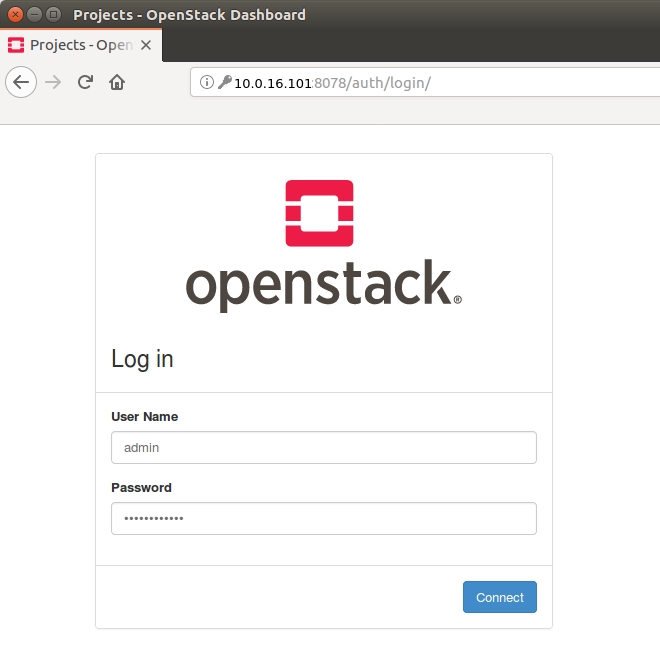
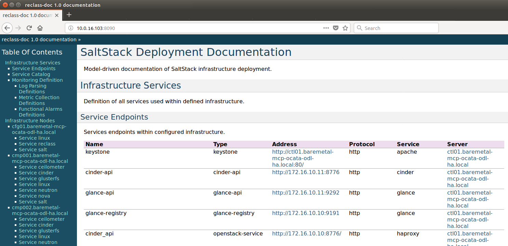
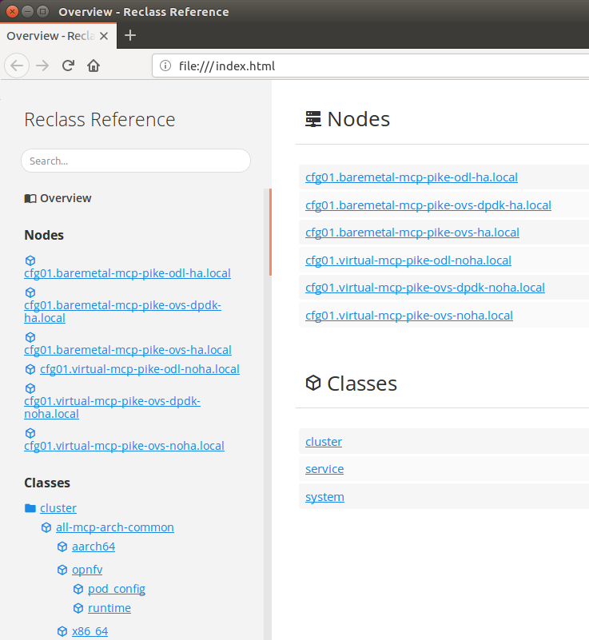

.. This work is licensed under a Creative Commons Attribution 4.0 International License.
.. http://creativecommons.org/licenses/by/4.0
.. (c) Open Platform for NFV Project, Inc. and its contributors

*********************
OPNFV Fuel User Guide
*********************

Abstract
========

This document contains details about using OPNFV Fuel ``Iruya`` release after
it was deployed. For details on how to deploy OpenStack, check
the installation instructions in the :ref:`fuel_userguide_references` section.

This is an unified documentation for both ``x86_64`` and ``aarch64``
architectures. All information is common for both architectures
except when explicitly stated.

Network Overview
================

Fuel uses several networks to deploy and administer the cloud:

+------------------+----------------------------------------------------------+
| Network name     | Description                                              |
|                  |                                                          |
+==================+==========================================================+
| **PXE/admin**    | Used for booting the nodes via PXE and/or Salt           |
|                  | control network                                          |
+------------------+----------------------------------------------------------+
| **mcpcontrol**   | Docker network used to provision the infrastructure      |
|                  | hosts (Salt & MaaS)                                      |
+------------------+----------------------------------------------------------+
| **management**   | Used for internal communication between                  |
|                  | OpenStack components                                     |
+------------------+----------------------------------------------------------+
| **internal**     | Used for VM data communication within the                |
|                  | cloud deployment                                         |
+------------------+----------------------------------------------------------+
| **public**       | Used to provide Virtual IPs for public endpoints         |
|                  | that are used to connect to OpenStack services APIs.     |
|                  | Used by Virtual machines to access the Internet          |
+------------------+----------------------------------------------------------+

These networks - except ``mcpcontrol`` - can be Linux bridges configured
before the deploy on the Jumpserver.
If they don't exists at deploy time, they will be created by the scripts as
``libvirt`` managed networks (except ``mcpcontrol``, which will be handled by
Docker using the ``bridge`` driver).

Network ``mcpcontrol``
~~~~~~~~~~~~~~~~~~~~~~

``mcpcontrol`` is a virtual network, managed by Docker. Its only purpose is to
provide a simple method of assigning an arbitrary ``INSTALLER_IP`` to the Salt
master node (``cfg01``), to maintain backwards compatibility with old OPNFV
Fuel behavior. Normally, end-users only need to change the ``INSTALLER_IP`` if
the default CIDR (``10.20.0.0/24``) overlaps with existing lab networks.

``mcpcontrol`` uses the Docker bridge driver, so the Salt master (``cfg01``)
and the MaaS containers (``mas01``, when present) get assigned predefined IPs
(``.2``, ``.3``, while the jumpserver gets ``.1``).

+------------------+---------------------------+-----------------------------+
| Host             | Offset in IP range        | Default address             |
+==================+===========================+=============================+
| ``jumpserver``   | 1st                       | ``10.20.0.1``               |
+------------------+---------------------------+-----------------------------+
| ``cfg01``        | 2nd                       | ``10.20.0.2``               |
+------------------+---------------------------+-----------------------------+
| ``mas01``        | 3rd                       | ``10.20.0.3``               |
+------------------+---------------------------+-----------------------------+

This network is limited to the ``jumpserver`` host and does not require any
manual setup.

Network ``PXE/admin``
~~~~~~~~~~~~~~~~~~~~~

.. TIP::

    ``PXE/admin`` does not usually use an IP range offset in ``IDF``.

.. NOTE::

    During ``MaaS`` commissioning phase, IP addresses are handed out by
    ``MaaS``'s DHCP.

.. WARNING::

    Default addresses in below table correspond to a ``PXE/admin`` CIDR of
    ``192.168.11.0/24`` (the usual value used in OPNFV labs).

    This is defined in ``IDF`` and can easily be changed to something else.

.. TODO: detail MaaS DHCP range start/end

+------------------+-----------------------+---------------------------------+
| Host             | Offset in IP range    | Default address                 |
+==================+=======================+=================================+
| ``jumpserver``   | 1st                   | ``192.168.11.1``                |
|                  |                       | (manual assignment)             |
+------------------+-----------------------+---------------------------------+
| ``cfg01``        | 2nd                   | ``192.168.11.2``                |
+------------------+-----------------------+---------------------------------+
| ``mas01``        | 3rd                   | ``192.168.11.3``                |
+------------------+-----------------------+---------------------------------+
| ``prx01``,       | 4th,                  | ``192.168.11.4``,               |
| ``prx02``        | 5th                   | ``192.168.11.5``                |
+------------------+-----------------------+---------------------------------+
| ``gtw01``,       | ...                   | ``...``                         |
| ``gtw02``,       |                       |                                 |
| ``gtw03``        |                       |                                 |
+------------------+-----------------------+---------------------------------+
| ``kvm01``,       |                       |                                 |
| ``kvm02``,       |                       |                                 |
| ``kvm03``        |                       |                                 |
+------------------+-----------------------+---------------------------------+
| ``dbs01``,       |                       |                                 |
| ``dbs02``,       |                       |                                 |
| ``dbs03``        |                       |                                 |
+------------------+-----------------------+---------------------------------+
| ``msg01``,       |                       |                                 |
| ``msg02``,       |                       |                                 |
| ``msg03``        |                       |                                 |
+------------------+-----------------------+---------------------------------+
| ``mdb01``,       |                       |                                 |
| ``mdb02``,       |                       |                                 |
| ``mdb03``        |                       |                                 |
+------------------+-----------------------+---------------------------------+
| ``ctl01``,       |                       |                                 |
| ``ctl02``,       |                       |                                 |
| ``ctl03``        |                       |                                 |
+------------------+-----------------------+---------------------------------+
| ``odl01``,       |                       |                                 |
| ``odl02``,       |                       |                                 |
| ``odl03``        |                       |                                 |
+------------------+-----------------------+---------------------------------+
| ``mon01``,       |                       |                                 |
| ``mon02``,       |                       |                                 |
| ``mon03``,       |                       |                                 |
| ``log01``,       |                       |                                 |
| ``log02``,       |                       |                                 |
| ``log03``,       |                       |                                 |
| ``mtr01``,       |                       |                                 |
| ``mtr02``,       |                       |                                 |
| ``mtr03``        |                       |                                 |
+------------------+-----------------------+---------------------------------+
| ``cmp001``,      |                       |                                 |
| ``cmp002``,      |                       |                                 |
| ``...``          |                       |                                 |
+------------------+-----------------------+---------------------------------+

Network ``management``
~~~~~~~~~~~~~~~~~~~~~~

.. TIP::

    ``management`` often has an IP range offset defined in ``IDF``.

.. WARNING::

    Default addresses in below table correspond to a ``management`` IP range of
    ``172.16.10.10-172.16.10.254`` (one of the commonly used values in OPNFV
    labs). This is defined in ``IDF`` and can easily be changed to something
    else. Since the ``jumpserver`` address is manually assigned, this is
    usually not subject to the IP range restriction in ``IDF``.

+------------------+-----------------------+---------------------------------+
| Host             | Offset in IP range    | Default address                 |
+==================+=======================+=================================+
| ``jumpserver``   | N/A                   | ``172.16.10.1``                 |
|                  |                       | (manual assignment)             |
+------------------+-----------------------+---------------------------------+
| ``cfg01``        | 1st                   | ``172.16.10.11``                |
+------------------+-----------------------+---------------------------------+
| ``mas01``        | 2nd                   | ``172.16.10.12``                |
+------------------+-----------------------+---------------------------------+
| ``prx``          | 3rd,                  | ``172.16.10.13``,               |
|                  |                       |                                 |
| ``prx01``,       | 4th,                  | ``172.16.10.14``,               |
| ``prx02``        | 5th                   | ``172.16.10.15``                |
+------------------+-----------------------+---------------------------------+
| ``gtw01``,       | ...                   | ``...``                         |
| ``gtw02``,       |                       |                                 |
| ``gtw03``        |                       |                                 |
+------------------+-----------------------+---------------------------------+
| ``kvm``,         |                       |                                 |
|                  |                       |                                 |
| ``kvm01``,       |                       |                                 |
| ``kvm02``,       |                       |                                 |
| ``kvm03``        |                       |                                 |
+------------------+-----------------------+---------------------------------+
| ``dbs``,         |                       |                                 |
|                  |                       |                                 |
| ``dbs01``,       |                       |                                 |
| ``dbs02``,       |                       |                                 |
| ``dbs03``        |                       |                                 |
+------------------+-----------------------+---------------------------------+
| ``msg``,         |                       |                                 |
|                  |                       |                                 |
| ``msg01``,       |                       |                                 |
| ``msg02``,       |                       |                                 |
| ``msg03``        |                       |                                 |
+------------------+-----------------------+---------------------------------+
| ``mdb``,         |                       |                                 |
|                  |                       |                                 |
| ``mdb01``,       |                       |                                 |
| ``mdb02``,       |                       |                                 |
| ``mdb03``        |                       |                                 |
+------------------+-----------------------+---------------------------------+
| ``ctl``,         |                       |                                 |
|                  |                       |                                 |
| ``ctl01``,       |                       |                                 |
| ``ctl02``,       |                       |                                 |
| ``ctl03``        |                       |                                 |
+------------------+-----------------------+---------------------------------+
| ``odl``,         |                       |                                 |
|                  |                       |                                 |
| ``odl01``,       |                       |                                 |
| ``odl02``,       |                       |                                 |
| ``odl03``        |                       |                                 |
+------------------+-----------------------+---------------------------------+
| ``mon``,         |                       |                                 |
|                  |                       |                                 |
| ``mon01``,       |                       |                                 |
| ``mon02``,       |                       |                                 |
| ``mon03``,       |                       |                                 |
|                  |                       |                                 |
| ``log``,         |                       |                                 |
|                  |                       |                                 |
| ``log01``,       |                       |                                 |
| ``log02``,       |                       |                                 |
| ``log03``,       |                       |                                 |
|                  |                       |                                 |
| ``mtr``,         |                       |                                 |
|                  |                       |                                 |
| ``mtr01``,       |                       |                                 |
| ``mtr02``,       |                       |                                 |
| ``mtr03``        |                       |                                 |
+------------------+-----------------------+---------------------------------+
| ``cmp001``,      |                       |                                 |
| ``cmp002``,      |                       |                                 |
| ``...``          |                       |                                 |
+------------------+-----------------------+---------------------------------+

Network ``internal``
~~~~~~~~~~~~~~~~~~~~

.. TIP::

    ``internal`` does not usually use an IP range offset in ``IDF``.

.. WARNING::

    Default addresses in below table correspond to an ``internal`` CIDR of
    ``10.1.0.0/24`` (the usual value used in OPNFV labs).
    This is defined in ``IDF`` and can easily be changed to something else.

+------------------+------------------------+--------------------------------+
| Host             | Offset in IP range     | Default address                |
+==================+========================+================================+
| ``jumpserver``   | N/A                    | ``10.1.0.1``                   |
|                  |                        | (manual assignment, optional)  |
+------------------+------------------------+--------------------------------+
| ``gtw01``,       | 1st,                   | ``10.1.0.2``,                  |
| ``gtw02``,       | 2nd,                   | ``10.1.0.3``,                  |
| ``gtw03``        | 3rd                    | ``10.1.0.4``                   |
+------------------+------------------------+--------------------------------+
| ``cmp001``,      | 4th,                   | ``10.1.0.5``,                  |
| ``cmp002``,      | 5th,                   | ``10.1.0.6``,                  |
| ``...``          | ...                    | ``...``                        |
+------------------+------------------------+--------------------------------+

Network ``public``
~~~~~~~~~~~~~~~~~~

.. TIP::

    ``public`` often has an IP range offset defined in ``IDF``.

.. WARNING::

    Default addresses in below table correspond to a ``public`` IP range of
    ``172.30.10.100-172.30.10.254`` (one of the used values in OPNFV
    labs). This is defined in ``IDF`` and can easily be changed to something
    else. Since the ``jumpserver`` address is manually assigned, this is
    usually not subject to the IP range restriction in ``IDF``.

+------------------+------------------------+--------------------------------+
| Host             | Offset in IP range     | Default address                |
+==================+========================+================================+
| ``jumpserver``   | N/A                    | ``172.30.10.72``               |
|                  |                        | (manual assignment, optional)  |
+------------------+------------------------+--------------------------------+
| ``prx``,         | 1st,                   | ``172.30.10.101``,             |
|                  |                        |                                |
| ``prx01``,       | 2nd,                   | ``172.30.10.102``,             |
| ``prx02``        | 3rd                    | ``172.30.10.103``              |
+------------------+------------------------+--------------------------------+
| ``gtw01``,       | 4th,                   | ``172.30.10.104``,             |
| ``gtw02``,       | 5th,                   | ``172.30.10.105``,             |
| ``gtw03``        | 6th                    | ``172.30.10.106``              |
+------------------+------------------------+--------------------------------+
| ``ctl01``,       | ...                    | ``...``                        |
| ``ctl02``,       |                        |                                |
| ``ctl03``        |                        |                                |
+------------------+------------------------+--------------------------------+
| ``odl``,         |                        |                                |
+------------------+------------------------+--------------------------------+
| ``cmp001``,      |                        |                                |
| ``cmp002``,      |                        |                                |
| ``...``          |                        |                                |
+------------------+------------------------+--------------------------------+

Accessing the Salt Master Node (``cfg01``)
==========================================

The Salt Master node (``cfg01``) runs a ``sshd`` server listening on
``0.0.0.0:22``.

To login as ``ubuntu`` user, use the RSA private key ``/var/lib/opnfv/mcp.rsa``:

.. code-block:: console

    jenkins@jumpserver:~$ ssh -o StrictHostKeyChecking=no \
                              -i /var/lib/opnfv/mcp.rsa \
                              -l ubuntu 10.20.0.2
    ubuntu@cfg01:~$

.. NOTE::

    User ``ubuntu`` has sudo rights.

.. TIP::

    The Salt master IP (``10.20.0.2``) is not hard set, it is configurable via
    ``INSTALLER_IP`` during deployment.

.. TIP::

    Starting with the ``Gambia`` release, ``cfg01`` is containerized, so this
    also works (from ``jumpserver`` only):

.. code-block:: console

    jenkins@jumpserver:~$ docker exec -it fuel bash
    root@cfg01:~$

Accessing the MaaS Node (``mas01``)
===================================

Starting with the ``Hunter`` release, the MaaS node (``mas01``) is
containerized and no longer runs a ``sshd`` server. To access it (from
``jumpserver`` only):

.. code-block:: console

    jenkins@jumpserver:~$ docker exec -it maas bash
    root@mas01:~$

Accessing Cluster Nodes
=======================

Logging in to cluster nodes is possible from the Jumpserver, Salt Master etc.

.. code-block:: console

    jenkins@jumpserver:~$ ssh -i /var/lib/opnfv/mcp.rsa ubuntu@192.168.11.52

.. TIP::

    ``/etc/hosts`` on ``cfg01`` has all the cluster hostnames, which can be
    used instead of IP addresses.

    ``/root/.ssh/config`` on ``cfg01`` configures the default user and key:
    ``ubuntu``, respectively ``/root/fuel/mcp/scripts/mcp.rsa``.

.. code-block:: console

    root@cfg01:~$ ssh ctl01

Debugging ``MaaS`` Comissioning/Deployment Issues
=================================================

One of the most common issues when setting up a new POD is ``MaaS`` failing to
commission/deploy the nodes, usually timing out after a couple of retries.

Such failures might indicate misconfiguration in ``PDF``/``IDF``, ``TOR``
switch configuration or even faulty hardware.

Here are a couple of pointers for isolating the problem.

Accessing the ``MaaS`` Dashboard
~~~~~~~~~~~~~~~~~~~~~~~~~~~~~~~~

``MaaS`` web-based dashboard is available at
``http://<jumpserver IP address>:5240/MAAS``.

The administrator credentials are ``opnfv``/``opnfv_secret``.

Ensure Commission/Deploy Timeouts Are Not Too Small
~~~~~~~~~~~~~~~~~~~~~~~~~~~~~~~~~~~~~~~~~~~~~~~~~~~

Some hardware takes longer to boot or to run the initial scripts during
commissioning/deployment phases. If that's the case, ``MaaS`` will time out
waiting for the process to finish. ``MaaS`` logs will reflect that, and the
issue is usually easy to observe on the nodes' serial console - if the node
seems to PXE-boot the OS live image, starts executing cloud-init/curtin
hooks without spilling critical errors, then it is powered down/shut off,
most likely the timeout was hit.

To access the serial console of a node, see your board manufacturer's
documentation. Some hardware no longer has a physical serial connector these
days, usually being replaced by a vendor-specific software-based interface.

If the board supports ``SOL`` (Serial Over LAN) over ``IPMI`` lanplus protocol,
a simpler solution to hook to the serial console is to use ``ipmitool``.

.. TIP::

    Early boot stage output might not be shown over ``SOL``, but only over
    the video console provided by the (vendor-specific) interface.

.. code-block:: console

    jenkins@jumpserver:~$ ipmitool -H <host BMC IP> -U <user> -P <pass> \
                                   -I lanplus sol activate

To bypass this, simply set a larger timeout in the ``IDF``.

Check Jumpserver Network Configuration
~~~~~~~~~~~~~~~~~~~~~~~~~~~~~~~~~~~~~~

.. code-block:: console

    jenkins@jumpserver:~$ brctl show
    jenkins@jumpserver:~$ ifconfig -a

+-----------------------+------------------------------------------------+
| Configuration item    | Expected behavior                              |
+=======================+================================================+
| IP addresses assigned | IP addresses should be assigned to the bridge, |
| to bridge ports       | and not to individual bridge ports             |
+-----------------------+------------------------------------------------+

Check Network Connectivity Between Nodes on the Jumpserver
~~~~~~~~~~~~~~~~~~~~~~~~~~~~~~~~~~~~~~~~~~~~~~~~~~~~~~~~~~

``cfg01`` is a Docker container running on the ``jumpserver``, connected to
Docker networks (created by docker-compose automatically on container up),
which in turn are connected using veth pairs to their ``libvirt`` managed
counterparts (or manually created bridges).

For example, the ``mgmt`` network(s) should look like below for a ``virtual``
deployment.

.. code-block:: console

    jenkins@jumpserver:~$ brctl show mgmt
    bridge name   bridge id           STP enabled   interfaces
    mgmt          8000.525400064f77   yes           mgmt-nic
                                                    veth_mcp2
                                                    vnet8

    jenkins@jumpserver:~$ docker network ls
    NETWORK ID    NAME                              DRIVER   SCOPE
    81a0fdb3bd78  docker-compose_mgmt               macvlan  local
    [...]

    jenkins@jumpserver:~$ docker network inspect docker-compose_mgmt
    [
        {
            "Name": "docker-compose_mgmt",
            [...]
            "Options": {
                "parent": "veth_mcp3"
            },
        }
    ]

Before investigating the rest of the cluster networking configuration, the
first thing to check is that ``cfg01`` has network connectivity to other
jumpserver hosted nodes, e.g. ``mas01`` and to the jumpserver itself
(provided that the jumpserver has an IP address in that particular network
segment).

.. code-block:: console

    jenkins@jumpserver:~$ docker exec -it fuel bash
    root@cfg01:~# ifconfig -a | grep inet
        inet addr:10.20.0.2     Bcast:0.0.0.0  Mask:255.255.255.0
        inet addr:172.16.10.2   Bcast:0.0.0.0  Mask:255.255.255.0
        inet addr:192.168.11.2  Bcast:0.0.0.0  Mask:255.255.255.0

For each network of interest (``mgmt``, ``PXE/admin``), check
that ``cfg01`` can ping the jumpserver IP in that network segment.

.. NOTE::

    ``mcpcontrol`` is set up at container bringup, so it should always be
    available, while the other networks are configured by Salt as part of the
    ``virtual_init`` STATE file.

.. code-block:: console

    root@cfg01:~# ping -c1 10.20.0.1  # mcpcontrol jumpserver IP
    root@cfg01:~# ping -c1 10.20.0.3  # mcpcontrol mas01 IP

.. TIP::

    ``mcpcontrol`` CIDR is configurable via ``INSTALLER_IP`` env var during
    deployment. However, IP offsets inside that segment are hard set to ``.1``
    for the jumpserver, ``.2`` for ``cfg01``, respectively to ``.3`` for
    ``mas01`` node.

.. code-block:: console

    root@cfg01:~# salt 'mas*' pillar.item --out yaml \
                  _param:infra_maas_node01_deploy_address \
                  _param:infra_maas_node01_address
    mas01.mcp-ovs-noha.local:
      _param:infra_maas_node01_address: 172.16.10.12
      _param:infra_maas_node01_deploy_address: 192.168.11.3

    root@cfg01:~# ping -c1 192.168.11.1  # PXE/admin jumpserver IP
    root@cfg01:~# ping -c1 192.168.11.3  # PXE/admin mas01 IP
    root@cfg01:~# ping -c1 172.16.10.1   # mgmt jumpserver IP
    root@cfg01:~# ping -c1 172.16.10.12  # mgmt mas01 IP

.. TIP::

    Jumpserver IP addresses for ``PXE/admin``, ``mgmt`` and ``public`` bridges
    are user-chosen and manually set, so above snippets should be adjusted
    accordingly if the user chose a different IP, other than ``.1`` in each
    CIDR.

Alternatively, a quick ``nmap`` scan would work just as well.

.. code-block:: console

    root@cfg01:~# apt update && apt install -y nmap
    root@cfg01:~# nmap -sn 10.20.0.0/24     # expected: cfg01, mas01, jumpserver
    root@cfg01:~# nmap -sn 192.168.11.0/24  # expected: cfg01, mas01, jumpserver
    root@cfg01:~# nmap -sn 172.16.10.0/24   # expected: cfg01, mas01, jumpserver

Check ``DHCP`` Reaches Cluster Nodes
~~~~~~~~~~~~~~~~~~~~~~~~~~~~~~~~~~~~

One common symptom observed during failed commissioning is that ``DHCP`` does
not work as expected between cluster nodes (baremetal nodes in the cluster; or
virtual machines on the jumpserver in case of ``hybrid`` deployments) and
the ``MaaS`` node.

To confirm or rule out this possibility, monitor the serial console output of
one (or more) cluster nodes during ``MaaS`` commissioning. If the node is
properly configured to attempt PXE boot, yet it times out waiting for an IP
address from ``mas01`` ``DHCP``, it's worth checking that ``DHCP`` packets
reach the ``jumpserver``, respectively the ``mas01`` container.

.. code-block:: console

    jenkins@jumpserver:~$ sudo apt update && sudo apt install -y dhcpdump
    jenkins@jumpserver:~$ sudo dhcpdump -i admin_br

.. TIP::

    If ``DHCP`` requests are present, but no replies are sent, ``iptables``
    might be interfering on the jumpserver.

Check ``MaaS`` Logs
~~~~~~~~~~~~~~~~~~~

If networking looks fine, yet nodes still fail to commission and/or deploy,
``MaaS`` logs might offer more details about the failure:

* ``/var/log/maas/maas.log``
* ``/var/log/maas/rackd.log``
* ``/var/log/maas/regiond.log``

.. TIP::

    If the problem is with the cluster node and not on the ``MaaS`` server,
    node's kernel logs usually contain useful information.
    These are saved via rsyslog on the ``mas01`` node in
    ``/var/log/maas/rsyslog``.

Recovering Failed Deployments
=============================

The first deploy attempt might fail due to various reasons. If the problem
is not systemic (i.e. fixing it will not introduce incompatible configuration
changes, like setting a different ``INSTALLER_IP``), the environment is safe
to be reused and the deployment process can pick up from where it left off.

Leveraging these mechanisms requires a minimum understanding of how the
deploy process works, at least for manual ``STATE`` runs.

Automatic (re)deploy
~~~~~~~~~~~~~~~~~~~~

OPNFV Fuel's ``deploy.sh`` script offers a dedicated argument for this, ``-f``,
which will skip executing the first ``N`` ``STATE`` files, where ``N`` is the
number of ``-f`` occurrences in the argument list.

.. TIP::

    The list of ``STATE`` files to be executed for a specific environment
    depends on the OPNFV scenario chosen, deployment type (``virtual``,
    ``baremetal`` or ``hybrid``) and the presence/absence of a ``VCP``
    (virtualized control plane).

e.g.: Let's consider a ``baremetal`` enviroment, with ``VCP`` and a simple
scenario ``os-nosdn-nofeature-ha``, where ``deploy.sh`` failed executing the
``openstack_ha`` ``STATE`` file.

The simplest redeploy approach (which usually works for **any** combination of
deployment type/VCP/scenario) is to issue the same deploy command as the
original attempt used, then adding a single ``-f``:

.. code-block:: console

    jenkins@jumpserver:~/fuel$ ci/deploy.sh -l <lab_name> -p <pod_name> \
                                            -s <scenario> [...] \
                                            -f # skips running the virtual_init STATE file

All ``STATE`` files are re-entrant, so the above is equivalent (but a little
slower) to skipping all ``STATE`` files before the ``openstack_ha`` one, like:

.. code-block:: console

    jenkins@jumpserver:~/fuel$ ci/deploy.sh -l <lab_name> -p <pod_name> \
                                            -s <scenario> [...] \
                                            -ffff # skips virtual_init, maas, baremetal_init, virtual_control_plane

.. TIP::

    For fine tuning the infrastructure setup steps executed during deployment,
    see also the ``-e`` and ``-P`` deploy arguments.

.. NOTE::

    On rare occassions, the cluster cannot idempotently be redeployed (e.g.
    broken MySQL/Galera cluster), in which case some cleanup is due before
    (re)running the ``STATE`` files. See ``-E`` deploy arg, which allows
    either forcing a ``MaaS`` node deletion, then redeployment of all
    baremetal nodes, if used twice (``-EE``); or only erasing the ``VCP`` VMs
    if used only once (``-E``).

Manual ``STATE`` Run
~~~~~~~~~~~~~~~~~~~~

Instead of leveraging the full ``deploy.sh``, one could execute the ``STATE``
files one by one (or partially) from the ``cfg01``.

However, this requires a better understanding of how the list of ``STATE``
files to be executed is constructed for a specific scenario, depending on the
deployment type and the cluster having baremetal nodes, implemented in:

* ``mcp/config/scenario/defaults.yaml.j2``
* ``mcp/config/scenario/<scenario-name>.yaml``

e.g.: For the example presented above (baremetal with ``VCP``,
``os-nosdn-nofeature-ha``), the list of ``STATE`` files would be:

* ``virtual_init``
* ``maas``
* ``baremetal_init``
* ``virtual_control_plane``
* ``openstack_ha``
* ``networks``

To execute one (or more) of the remaining ``STATE`` files after a failure:

.. code-block:: console

    jenkins@jumpserver:~$ docker exec -it fuel bash
    root@cfg01:~$ cd ~/fuel/mcp/config/states
    root@cfg01:~/fuel/mcp/config/states$ ./openstack_ha
    root@cfg01:~/fuel/mcp/config/states$ CI_DEBUG=true ./networks

For even finer granularity, one can also run the commands in a ``STATE`` file
one by one manually, e.g. if the execution failed applying the ``rabbitmq``
sls:

.. code-block:: console

    root@cfg01:~$ salt -I 'rabbitmq:server' state.sls rabbitmq

Exploring the Cloud with Salt
=============================

To gather information about the cloud, the salt commands can be used.
It is based around a master-minion idea where the salt-master pushes config to
the minions to execute actions.

For example tell salt to execute a ping to ``8.8.8.8`` on all the nodes.

.. code-block:: console

    root@cfg01:~$ salt "*" network.ping 8.8.8.8
                       ^^^                       target
                           ^^^^^^^^^^^^          function to execute
                                        ^^^^^^^  argument passed to the function

.. TIP::

    Complex filters can be done to the target like compound queries or node roles.

For more information about Salt see the :ref:`fuel_userguide_references`
section.

Some examples are listed below. Note that these commands are issued from Salt
master as ``root`` user.

View the IPs of All the Components
~~~~~~~~~~~~~~~~~~~~~~~~~~~~~~~~~~

.. code-block:: console

    root@cfg01:~$ salt "*" network.ip_addrs
    cfg01.mcp-odl-ha.local:
       - 10.20.0.2
       - 172.16.10.100
    mas01.mcp-odl-ha.local:
       - 10.20.0.3
       - 172.16.10.3
       - 192.168.11.3
    .........................

View the Interfaces of All the Components and Put the Output in a ``yaml`` File
~~~~~~~~~~~~~~~~~~~~~~~~~~~~~~~~~~~~~~~~~~~~~~~~~~~~~~~~~~~~~~~~~~~~~~~~~~~~~~~

.. code-block:: console

    root@cfg01:~$ salt "*" network.interfaces --out yaml --output-file interfaces.yaml
    root@cfg01:~# cat interfaces.yaml
    cfg01.mcp-odl-ha.local:
     enp1s0:
       hwaddr: 52:54:00:72:77:12
       inet:
       - address: 10.20.0.2
         broadcast: 10.20.0.255
         label: enp1s0
         netmask: 255.255.255.0
       inet6:
       - address: fe80::5054:ff:fe72:7712
         prefixlen: '64'
         scope: link
       up: true
    .........................

View Installed Packages on MaaS Node
~~~~~~~~~~~~~~~~~~~~~~~~~~~~~~~~~~~~

.. code-block:: console

    root@cfg01:~# salt "mas*" pkg.list_pkgs
    mas01.mcp-odl-ha.local:
        ----------
        accountsservice:
            0.6.40-2ubuntu11.3
        acl:
            2.2.52-3
        acpid:
            1:2.0.26-1ubuntu2
        adduser:
            3.113+nmu3ubuntu4
        anerd:
            1
    .........................

Execute Any Linux Command on All Nodes (e.g. ``ls /var/log``)
~~~~~~~~~~~~~~~~~~~~~~~~~~~~~~~~~~~~~~~~~~~~~~~~~~~~~~~~~~~~~

.. code-block:: console

    root@cfg01:~# salt "*" cmd.run 'ls /var/log'
    cfg01.mcp-odl-ha.local:
       alternatives.log
       apt
       auth.log
       boot.log
       btmp
       cloud-init-output.log
       cloud-init.log
    .........................

Execute Any Linux Command on Nodes Using Compound Queries Filter
~~~~~~~~~~~~~~~~~~~~~~~~~~~~~~~~~~~~~~~~~~~~~~~~~~~~~~~~~~~~~~~~

.. code-block:: console

    root@cfg01:~# salt -C '* and cfg01*' cmd.run 'ls /var/log'
    cfg01.mcp-odl-ha.local:
       alternatives.log
       apt
       auth.log
       boot.log
       btmp
       cloud-init-output.log
       cloud-init.log
    .........................

Execute Any Linux Command on Nodes Using Role Filter
~~~~~~~~~~~~~~~~~~~~~~~~~~~~~~~~~~~~~~~~~~~~~~~~~~~~

.. code-block:: console

    root@cfg01:~# salt -I 'nova:compute' cmd.run 'ls /var/log'
    cmp001.mcp-odl-ha.local:
       alternatives.log
       apache2
       apt
       auth.log
       btmp
       ceilometer
       cinder
       cloud-init-output.log
       cloud-init.log
    .........................

Accessing Openstack
===================

Once the deployment is complete, Openstack CLI is accessible from controller
VMs (``ctl01`` ... ``ctl03``).

Openstack credentials are at ``/root/keystonercv3``.

.. code-block:: console

    root@ctl01:~# source keystonercv3
    root@ctl01:~# openstack image list
    +--------------------------------------+-----------------------------------------------+--------+
    | ID                                   | Name                                          | Status |
    +======================================+===============================================+========+
    | 152930bf-5fd5-49c2-b3a1-cae14973f35f | CirrosImage                                   | active |
    | 7b99a779-78e4-45f3-9905-64ae453e3dcb | Ubuntu16.04                                   | active |
    +--------------------------------------+-----------------------------------------------+--------+

The OpenStack Dashboard, Horizon, is available at ``http://<proxy public VIP>``.
The administrator credentials are ``admin``/``opnfv_secret``.

A full list of IPs/services is available at ``<proxy public VIP>:8090`` for
``baremetal`` deploys.

Guest Operating System Support
==============================

There are a number of possibilities regarding the guest operating systems
which can be spawned on the nodes.
The current system spawns virtual machines for VCP VMs on the KVM nodes and VMs
requested by users in OpenStack compute nodes. Currently the system supports
the following ``UEFI``-images for the guests:

+------------------+-------------------+--------------------+
| OS name          | ``x86_64`` status | ``aarch64`` status |
+==================+===================+====================+
| Ubuntu 17.10     | untested          | Full support       |
+------------------+-------------------+--------------------+
| Ubuntu 16.04     | Full support      | Full support       |
+------------------+-------------------+--------------------+
| Ubuntu 14.04     | untested          | Full support       |
+------------------+-------------------+--------------------+
| Fedora atomic 27 | untested          | Full support       |
+------------------+-------------------+--------------------+
| Fedora cloud 27  | untested          | Full support       |
+------------------+-------------------+--------------------+
| Debian           | untested          | Full support       |
+------------------+-------------------+--------------------+
| Centos 7         | untested          | Not supported      |
+------------------+-------------------+--------------------+
| Cirros 0.3.5     | Full support      | Full support       |
+------------------+-------------------+--------------------+
| Cirros 0.4.0     | Full support      | Full support       |
+------------------+-------------------+--------------------+

The above table covers only ``UEFI`` images and implies ``OVMF``/``AAVMF``
firmware on the host. An ``x86_64`` deployment also supports ``non-UEFI``
images, however that choice is up to the underlying hardware and the
administrator to make.

The images for the above operating systems can be found in their respective
websites.

OpenStack Storage
=================

OpenStack Cinder is the project behind block storage in OpenStack and OPNFV
Fuel supports LVM out of the box.

By default ``x86_64`` supports 2 additional block storage devices, while
``aarch64`` supports only one.

More devices can be supported if the OS-image created has additional
properties allowing block storage devices to be spawned as ``SCSI`` drives.
To do this, add the properties below to the server:

.. code-block:: console

    root@ctl01:~$ openstack image set --property hw_disk_bus='scsi' \
                                      --property hw_scsi_model='virtio-scsi' \
                                      <image>

The choice regarding which bus to use for the storage drives is an important
one. ``virtio-blk`` is the default choice for OPNFV Fuel, which attaches the
drives in ``/dev/vdX``. However, since we want to be able to attach a
larger number of volumes to the virtual machines, we recommend the switch to
``SCSI`` drives which are attached in ``/dev/sdX`` instead.

``virtio-scsi`` is a little worse in terms of performance but the ability to
add a larger number of drives combined with added features like ZFS, Ceph et
al, leads us to suggest the use of ``virtio-scsi`` in OPNFV Fuel for both
architectures.

More details regarding the differences and performance of ``virtio-blk`` vs
``virtio-scsi`` are beyond the scope of this manual but can be easily found
in other sources online like `VirtIO SCSI`_ or `VirtIO performance`_.

Additional configuration for configuring images in OpenStack can be found in
the OpenStack Glance documentation.

OpenStack Endpoints
===================

For each OpenStack service three endpoints are created: ``admin``, ``internal``
and ``public``.

.. code-block:: console

    ubuntu@ctl01:~$ openstack endpoint list --service keystone
    +----------------------------------+-----------+--------------+--------------+---------+-----------+------------------------------+
    | ID                               | Region    | Service Name | Service Type | Enabled | Interface | URL                          |
    +----------------------------------+-----------+--------------+--------------+---------+-----------+------------------------------+
    | 008fec57922b4e9e8bf02c770039ae77 | RegionOne | keystone     | identity     | True    | internal  | http://172.16.10.26:5000/v3  |
    | 1a1f3c3340484bda9ef7e193f50599e6 | RegionOne | keystone     | identity     | True    | admin     | http://172.16.10.26:35357/v3 |
    | b0a47d42d0b6491b995d7e6230395de8 | RegionOne | keystone     | identity     | True    | public    | https://10.0.15.2:5000/v3    |
    +----------------------------------+-----------+--------------+--------------+---------+-----------+------------------------------+

MCP sets up all Openstack services to talk to each other over unencrypted
connections on the internal management network. All admin/internal endpoints
use plain http, while the public endpoints are https connections terminated
via nginx at the ``VCP`` proxy VMs.

To access the public endpoints an SSL certificate has to be provided. For
convenience, the installation script will copy the required certificate
to the ``cfg01`` node at ``/etc/ssl/certs/os_cacert``.

Copy the certificate from the ``cfg01`` node to the client that will access
the https endpoints and place it under ``/etc/ssl/certs/``.
The SSL connection will be established automatically after.

.. code-block:: console

    jenkins@jumpserver:~$ ssh -o StrictHostKeyChecking=no -i /var/lib/opnfv/mcp.rsa -l ubuntu 10.20.0.2 \
      "cat /etc/ssl/certs/os_cacert" | sudo tee /etc/ssl/certs/os_cacert

Reclass Model Viewer Tutorial
=============================

In order to get a better understanding of the ``reclass`` model Fuel uses, the
`reclass-doc`_ tool can be used to visualise the ``reclass`` model.

To avoid installing packages on the ``jumpserver`` or another host, the
``cfg01`` Docker container can be used. Since the ``fuel`` git repository
located on the ``jumpserver`` is already mounted inside ``cfg01`` container,
the results can be visualized using a web browser on the ``jumpserver`` at the
end of the procedure.

.. code-block:: console

    jenkins@jumpserver:~$ docker exec -it fuel bash
    root@cfg01:~$ apt-get update
    root@cfg01:~$ apt-get install -y npm nodejs
    root@cfg01:~$ npm install -g reclass-doc
    root@cfg01:~$ ln -s /usr/bin/nodejs /usr/bin/node
    root@cfg01:~$ reclass-doc --output ~/fuel/mcp/reclass/modeler \
                                       ~/fuel/mcp/reclass

The generated documentation should be available on the ``jumpserver`` inside
``fuel`` git repo subpath ``mcp/reclass/modeler/index.html``.

.. _fuel_userguide_references:

References
==========

#. :ref:`OPNFV Fuel Installation Instruction <fuel-installation>`
#. `Saltstack Documentation`_
#. `Saltstack Formulas`_
#. `VirtIO performance`_
#. `VirtIO SCSI`_

.. _`Saltstack Documentation`: https://docs.saltstack.com/en/latest/topics/
.. _`Saltstack Formulas`: https://salt-formulas.readthedocs.io/en/latest/
.. _`VirtIO performance`: https://mpolednik.github.io/2017/01/23/virtio-blk-vs-virtio-scsi/
.. _`VirtIO SCSI`: https://www.ovirt.org/develop/release-management/features/storage/virtio-scsi/
.. _`reclass-doc`: https://github.com/jirihybek/reclass-doc
