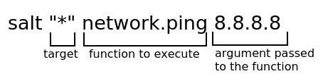

.. This work is licensed under a Creative Commons Attribution 4.0 International License.
.. http://creativecommons.org/licenses/by/4.0
.. (c) Open Platform for NFV Project, Inc. and its contributors

========
Abstract
========

This document contains details about how to use OPNFV Fuel - Fraser
release - after it was deployed. For details on how to deploy check the
installation instructions in the :ref:`fuel_userguide_references` section.

This is an unified documentation for both x86_64 and aarch64
architectures. All information is common for both architectures
except when explicitly stated.

================
Network Overview
================

Fuel uses several networks to deploy and administer the cloud:

+------------------+---------------------------------------------------------+
| Network name     | Description                                             |
|                  |                                                         |
+==================+=========================================================+
| **PXE/ADMIN**    | Used for booting the nodes via PXE and/or Salt          |
|                  | control network                                         |
+------------------+---------------------------------------------------------+
| **MCPCONTROL**   | Used to provision the infrastructure VMs (Salt & MaaS)  |
+------------------+---------------------------------------------------------+
| **Mgmt**         | Used for internal communication between                 |
|                  | OpenStack components                                    |
+------------------+---------------------------------------------------------+
| **Internal**     | Used for VM data communication within the               |
|                  | cloud deployment                                        |
+------------------+---------------------------------------------------------+
| **Public**       | Used to provide Virtual IPs for public endpoints        |
|                  | that are used to connect to OpenStack services APIs.    |
|                  | Used by Virtual machines to access the Internet         |
+------------------+---------------------------------------------------------+

These networks - except mcpcontrol - can be linux bridges configured before the deploy on the
Jumpserver. If they don't exists at deploy time, they will be created by the scripts as virsh
networks.

Mcpcontrol exists only on the Jumpserver and needs to be virtual because a DHCP server runs
on this network and associates static host entry IPs for Salt and Maas VMs.

===================
Accessing the Cloud
===================

Access to any component of the deployed cloud is done from Jumpserver to user *ubuntu* with
ssh key */var/lib/opnfv/mcp.rsa*. The example below is a connection to Salt master.

    .. code-block:: bash

        $ ssh -o StrictHostKeyChecking=no -i  /var/lib/opnfv/mcp.rsa  -l ubuntu 10.20.0.2

**Note**: The Salt master IP is not hard set, it is configurable via INSTALLER_IP during deployment

Logging in to cluster nodes is possible from the Jumpserver and from Salt master. On the Salt master
cluster hostnames can be used instead of IP addresses:

    .. code-block:: bash

        $ sudo -i
        $ ssh -i mcp.rsa ubuntu@ctl01

User *ubuntu* has sudo rights.

=============================
Exploring the Cloud with Salt
=============================

To gather information about the cloud, the salt commands can be used. It is based
around a master-minion idea where the salt-master pushes config to the minions to
execute actions.

For example tell salt to execute a ping to 8.8.8.8 on all the nodes.

Complex filters can be done to the target like compound queries or node roles.
For more information about Salt see the :ref:`fuel_userguide_references` section.

Some examples are listed below. Note that these commands are issued from Salt master
as *root* user.

#. View the IPs of all the components

    .. code-block:: bash

        root@cfg01:~$ salt "*" network.ip_addrs
        cfg01.mcp-pike-odl-ha.local:
           - 10.20.0.2
           - 172.16.10.100
        mas01.mcp-pike-odl-ha.local:
           - 10.20.0.3
           - 172.16.10.3
           - 192.168.11.3
        .........................

#. View the interfaces of all the components and put the output in a file with yaml format

    .. code-block:: bash

        root@cfg01:~$ salt "*" network.interfaces --out yaml --output-file interfaces.yaml
        root@cfg01:~# cat interfaces.yaml
        cfg01.mcp-pike-odl-ha.local:
         enp1s0:
           hwaddr: 52:54:00:72:77:12
           inet:
           - address: 10.20.0.2
             broadcast: 10.20.0.255
             label: enp1s0
             netmask: 255.255.255.0
           inet6:
           - address: fe80::5054:ff:fe72:7712
             prefixlen: '64'
             scope: link
           up: true
        .........................

#. View installed packages in MaaS node

    .. code-block:: bash

        root@cfg01:~# salt "mas*" pkg.list_pkgs
        mas01.mcp-pike-odl-ha.local:
            ----------
            accountsservice:
                0.6.40-2ubuntu11.3
            acl:
                2.2.52-3
            acpid:
                1:2.0.26-1ubuntu2
            adduser:
                3.113+nmu3ubuntu4
            anerd:
                1
        .........................

#. Execute any linux command on all nodes (list the content of */var/log* in this example)

    .. code-block:: bash

        root@cfg01:~# salt "*" cmd.run 'ls /var/log'
        cfg01.mcp-pike-odl-ha.local:
           alternatives.log
           apt
           auth.log
           boot.log
           btmp
           cloud-init-output.log
           cloud-init.log
        .........................

#. Execute any linux command on nodes using compound queries filter

    .. code-block:: bash

        root@cfg01:~# salt -C '* and cfg01*' cmd.run 'ls /var/log'
        cfg01.mcp-pike-odl-ha.local:
           alternatives.log
           apt
           auth.log
           boot.log
           btmp
           cloud-init-output.log
           cloud-init.log
        .........................

#. Execute any linux command on nodes using role filter

    .. code-block:: bash

        root@cfg01:~# salt -I 'nova:compute' cmd.run 'ls /var/log'
        cmp001.mcp-pike-odl-ha.local:
           alternatives.log
           apache2
           apt
           auth.log
           btmp
           ceilometer
           cinder
           cloud-init-output.log
           cloud-init.log
        .........................

===================
Accessing Openstack
===================

Once the deployment is complete, Openstack CLI is accessible from controller VMs (ctl01..03).
Openstack credentials are at */root/keystonercv3*.

    .. code-block:: bash

        root@ctl01:~# source keystonercv3
        root@ctl01:~# openstack image list
        +--------------------------------------+-----------------------------------------------+--------+
        | ID                                   | Name                                          | Status |
        +======================================+===============================================+========+
        | 152930bf-5fd5-49c2-b3a1-cae14973f35f | CirrosImage                                   | active |
        | 7b99a779-78e4-45f3-9905-64ae453e3dcb | Ubuntu16.04                                   | active |
        +--------------------------------------+-----------------------------------------------+--------+

The OpenStack Dashboard, Horizon, is available at http://<proxy public VIP>
The administrator credentials are *admin*/*opnfv_secret*.

.. figure:: img/horizon_login.png

A full list of IPs/services is available at <proxy public VIP>:8090 for baremetal deploys.

.. figure:: img/salt_services_ip.png

==============================
Guest Operating System Support
==============================

There are a number of possibilities regarding the guest operating systems which can be spawned
on the nodes. The current system spawns virtual machines for VCP VMs on the KVM nodes  and VMs
requested by users in OpenStack compute nodes. Currently the system supports the following
UEFI-images for the guests:

+------------------+-------------------+------------------+
| OS name          | x86_64 status     | aarch64 status   |
+==================+===================+==================+
| Ubuntu 17.10     | untested          | Full support     |
+------------------+-------------------+------------------+
| Ubuntu 16.04     | Full support      | Full support     |
+------------------+-------------------+------------------+
| Ubuntu 14.04     | untested          | Full support     |
+------------------+-------------------+------------------+
| Fedora atomic 27 | untested          | Not supported    |
+------------------+-------------------+------------------+
| Fedora cloud 27  | untested          | Not supported    |
+------------------+-------------------+------------------+
| Debian           | untested          | Full support     |
+------------------+-------------------+------------------+
| Centos 7         | untested          | Not supported    |
+------------------+-------------------+------------------+
| Cirros 0.3.5     | Full support      | Full support     |
+------------------+-------------------+------------------+
| Cirros 0.4.0     | Full support      | Full support     |
+------------------+-------------------+------------------+

The above table covers only UEFI image and implies OVMF/AAVMF firmware on the host. An x86 deployment
also supports non-UEFI images, however that choice is up to the underlying hardware and the administrator
to make.

The images for the above operating systems can be found in their respective websites.

=================
OpenStack Storage
=================

OpenStack Cinder is the project behind block storage in OpenStack and opnfv supports LVM out of the box.
By default x86 supports 2 additional block storage devices and ARMBand supports only one.
More devices can be supported if the OS-image created has additional properties allowing block storage devices
to be spawned as scsi drives. To do this, add the properties below to the server:

    .. code-block:: bash

       openstack image set --property hw_disk_bus='scsi' --property hw_scsi_model='virtio-scsi' <image>

The choice regarding which bus to use for the storage drives is an important one. Virtio-blk is the default
choice for opnfv-fuel which attaches the drives in /dev/vdX. However the default ubuntu kernel in 16.04
and 14.04 guest does not see these devices in aarch64. So in order to use any volumes in ARMband a switch
has to be made to virtio-scsi and attach all drives in /dev/sdX. Virtio-scsi is a little worse in terms of
performance but the ability to add a large number of drives combined with added features like ZFS, Ceph et al,
leads us to suggest the use of virtio-scsi in opnfv-fuel.

More details regarding the differences and performance of virtio-blk vs virtio-scsi are beyond the scope
of this manual but can be easily found in other sources online.
Additional configuration for configuring images in openstack can be found in the OpenStack Glance documentation.

===================
Openstack Endpoints
===================

For each Openstack service three endpoints are created: admin, internal and public.

    .. code-block:: bash

        ubuntu@ctl01:~$ openstack endpoint list --service keystone
        +----------------------------------+-----------+--------------+--------------+---------+-----------+------------------------------+
        | ID                               | Region    | Service Name | Service Type | Enabled | Interface | URL                          |
        +----------------------------------+-----------+--------------+--------------+---------+-----------+------------------------------+
        | 008fec57922b4e9e8bf02c770039ae77 | RegionOne | keystone     | identity     | True    | internal  | http://172.16.10.26:5000/v3  |
        | 1a1f3c3340484bda9ef7e193f50599e6 | RegionOne | keystone     | identity     | True    | admin     | http://172.16.10.26:35357/v3 |
        | b0a47d42d0b6491b995d7e6230395de8 | RegionOne | keystone     | identity     | True    | public    | https://10.0.15.2:5000/v3    |
        +----------------------------------+-----------+--------------+--------------+---------+-----------+------------------------------+

MCP sets up all Openstack services to talk to each other over unencrypted
connections on the internal management network. All admin/internal endpoints use
plain http, while the public endpoints are https connections terminated via nginx
at the VCP proxy VMs.

To access the public endpoints an SSL certificate has to be provided. For
convenience, the installation script will copy the required certificate into
to the cfg01 node at /etc/ssl/certs/os_cacert.

Copy the certificate from the cfg01 node to the client that will access the https
endpoints and place it under /etc/ssl/certs. The SSL connection will be established
automatically after.

    .. code-block:: bash

        $ ssh -o StrictHostKeyChecking=no -i  /var/lib/opnfv/mcp.rsa  -l ubuntu 10.20.0.2 \
        "cat /etc/ssl/certs/os_cacert" | sudo tee /etc/ssl/certs/os_cacert

=============================
Reclass model viewer tutorial
=============================

In order to get a better understanding on the reclass model Fuel uses, the `reclass-doc
<https://github.com/jirihybek/reclass-doc>`_ can be used to visualise the reclass model.
A simplified installation can be done with the use of a docker ubuntu container. This
approach will avoid installing packages on the host, which might collide with other packages.
After the installation is done, a webbrowser on the host can be used to view the results.

**NOTE**: The host can be any device with Docker package already installed.
          The user which runs the docker needs to have root priviledges.

**Instructions**

#. Create a new directory at any location

    .. code-block:: bash

        $ mkdir -p modeler

#. Place fuel repo in the above directory

    .. code-block:: bash

        $ cd modeler
        $ git clone https://gerrit.opnfv.org/gerrit/fuel && cd fuel

#. Create a container and mount the above host directory

    .. code-block:: bash

        $ docker run --privileged -it -v <absolute_path>/modeler:/host ubuntu bash

#. Install all the required packages inside the container.

    .. code-block:: bash

        $ apt-get update
        $ apt-get install -y npm nodejs
        $ npm install -g reclass-doc
        $ cd /host/fuel/mcp/reclass
        $ ln -s /usr/bin/nodejs /usr/bin/node
        $ reclass-doc --output /host /host/fuel/mcp/reclass

#. View the results from the host by using a browser. The file to open should be now at modeler/index.html

   .. figure:: img/reclass_doc.png

.. _fuel_userguide_references:

==========
References
==========

1) :ref:`fuel-release-installation-label`
2) `Saltstack Documentation <https://docs.saltstack.com/en/latest/topics>`_
3) `Saltstack Formulas <http://salt-formulas.readthedocs.io/en/latest/>`_
